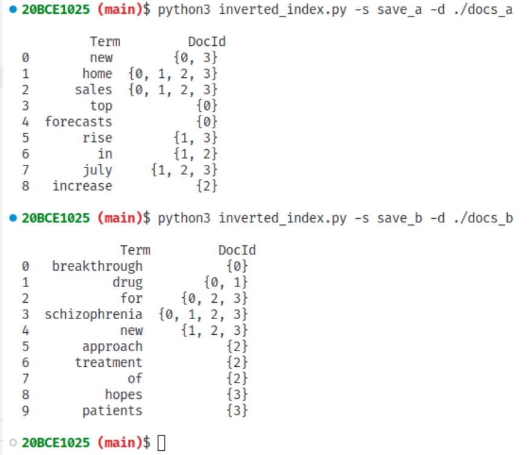
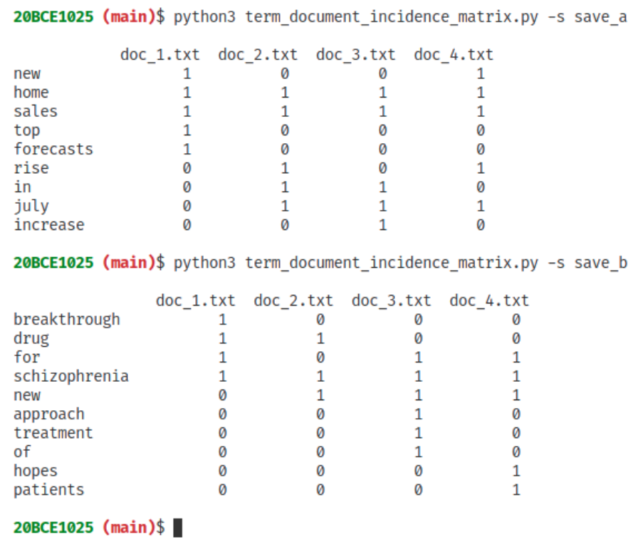
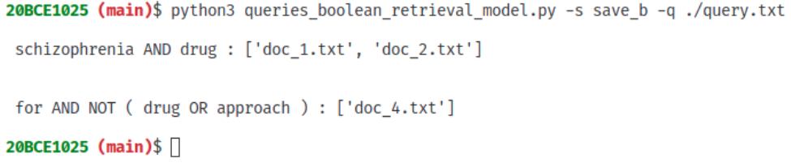

<h2>To Generate Inverted Index:</h2>

Give command as

    python3   inverted_index.py  –s  <save_file_name>   -d  <dir_where_doc_colletions_stored>

 

<h2>To generate term-document incidence matrix:</h2>

Give command as

    python3    term_document_incidence_matrix.py    -s     <saved_file_name>

 

<h2>To compute the results for queries using Boolean retrieval model:</h2>

Give command as

    python3 queries_boolean_retrieval_model.py -s <saved_file_name> -q <query_file>

